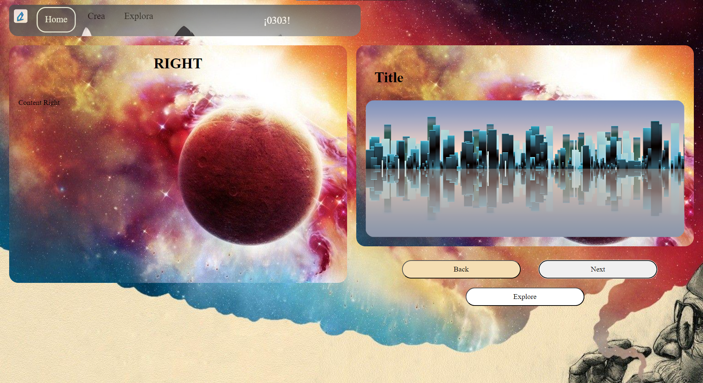

# Plantilla Básica de Página para Cuentos

## Descripción

Esta es una plantilla básica para una página web destinada a mostrar y gestionar cuentos. Está construida con HTML, CSS y JavaScript, proporcionando una interfaz sencilla y funcional para la visualización de cuentos.

## Características

- **Interfaz Sencilla**: Fácil de usar y navegar.
- **Sección de Cuentos**: Visualización de una lista de cuentos con detalles.
- **Página de Detalle**: Vista detallada de cada cuento.

## Capturas de Pantalla

### Página Principal

### Detalle del Cuento

